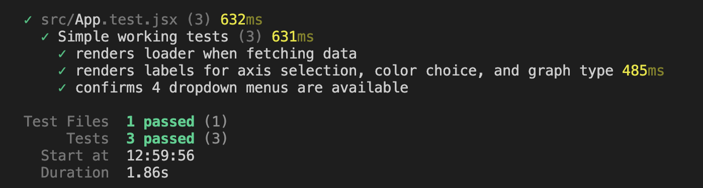

# Dimension Explorer App

Explore and filter high-dimensional data sets with ease. Choose the dimensions you want to analyze, set minimum and maximum values, and visualize the results interactively.

## To Run Local Build
`npm run dev`

## Key Functionality
A user should be able to do the following things:
- [x] Choose which combination of dimensions to display.
- [x] For each dimension, specify a minimum and maximum value to include in the displayed results. 
- [x] Data points outside the allowed range should not be displayed.
- [x] Users can choose any combination of any number of dimensions to display.
- [x] This UI can be used to visualize different data sets with different dimensionality.  
- [x] Indicate loading and error states.
- [x] The App was deployed to Netlify: https://dimension-explorer.netlify.app/

## Implementations Details
### Data Fetching and Management:
- `React Query`: Efficiently manages API requests and data fetching, ensuring optimal performance and data handling.
  
### UI Design and Components:
- `React DaisyUI`: Provides ready-made, accessible, and responsive UI components built with Tailwind CSS. This allows for rapid development and consistent UI styling.
- `Tailwind CSS`: A utility-first CSS framework enabling efficient and customizable UI development.

### State Management and Functionality:
- `React Hooks`:
- - `useState`: Manages local component state effectively.
- - `useEffect`: Performs side effects and interacts with APIs.
- - `useContext`: Provides access to global context data throughout components.
- - `useReducer`: Manages complex state transitions using a reducer function.

### Additional Libraries:
- `@observablehq/plot`: Generates interactive data visualizations used in the application.
- `react-range-slider-input`: Provides a user-friendly range slider component for data filtering.

## Testing
- Automated unit tests using `React Testing Library`.

